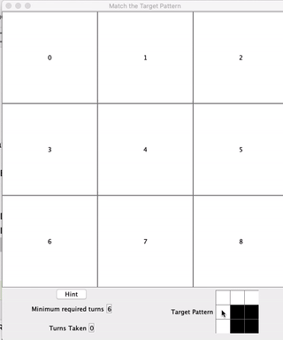
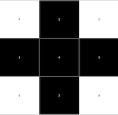
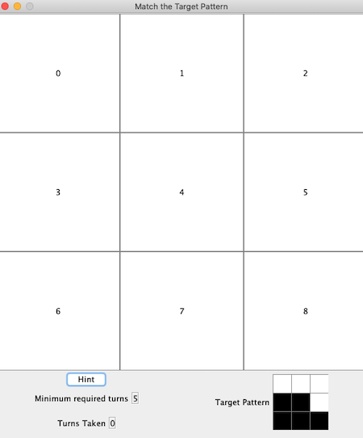
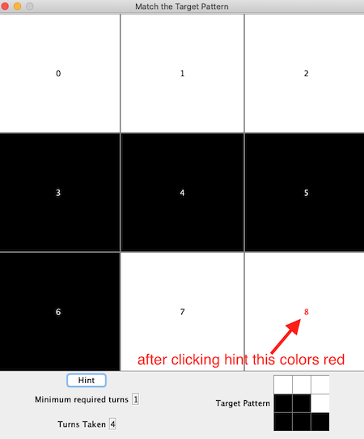

# Toggle Game Assignment

*An upfront quick note to say that for this assignment you are encouraged to try AI programming assistants ... Github Co-pilot, or OpenAI or other AI coding / language assistants. It's not required and there is no grading associated with trying out an AI coding assistant but you are encouraged to try these technologies if you are inclined. Just add a line to any file that you had support with to indicate where the AI provided assistance e.g.,:*

```java
/**
 AI Assistance was used in the following methods in this file:
 
 - toStartPressAnykey() 
 - thatDogHasAPuffyTail()
 - solveAssignmentInOneHugeMethod()
 
**/

```
*Time pending we may discuss people's experience with the AI tools during a lecture later in the term*



In this assignment you are tasked with creating the backend for a simple game. You are given the code for the frontend of the game and number of tests that your backend should pass to ensure it works properly. You may work in pairs or solo on this assignment. If working in pairs both students will receive the same grade.

The game is a 3x3 grid of squares that are either black or white. Clicking on any square will change the color of that square and its 4 neighbours (north, south, east and west) to their opposite color, i.e., black becomes white and vice versa.

Example: Clicking the middle square on the first board below will yield the second board:

  clicking square 4 (middle square) yields 

Games start with the 3x3 grid comprised solely of white squares and players are shown a randomly generated target board configuration of black and white squares. The goal for the player is to click squares and eventually end up with the target configuration (coloring).

See below the initial game screen:



Your code must implement that following ToggleGameInteraction interface in the `ToggleGameEngine.java` file:

```java
/**
 * The required functionality for the front-end to operate correctly in the
 * Toggle Game.
 *
 * No alterations are required in this file.
 *
 * You should implement this interface in your ToggleGameEngine Solution
 */
public interface ToggleGameInteraction {
    /*
     *  Game board buttons are numbered as follows:
     *    0 1 2
     *    3 4 5
     *    6 7 8
     */


    /**
     * Initialize and return the game board for a ToggleGame
     * @return the String "111111111" to start a game with all white squares
     */
    public String initializeGame();

    /**
     * Update the game board for the given button that was clicked.
     * Squares marked as 0 are black and 1 is white
     *
     * @param button the game board square button that was clicked (between 0 and 8)
     *
     * @return the updated game board as a String giving the button colors in order
     *         with "0" for black and "1" for white.
     *
     * @throws IllegalArgumentException when button is outside 0:8
     */
    public String buttonClicked(String currentBoard, int button);

    /**
     * Return a sequence of moves that leads in the minimum number of moves
     * from the current board state to the target state
     *
     * @param current the current board state given as a String of 1's (white square)
     *                and 0's (black square)
     * @param target the target board state given as a String of 1's (white square)
     *               and 0's (black square)
     * @return the sequence of moves to advance the board from current to target.
     *         Each move is the number associated with a button on the board
     *
     */
    public int[] movesToSolve(String current, String target);

    /**
     * Return the minimum required number of required moves (button clicks)
     * to advance the current board to the target board.
     *
     * @param current the current board state given as a String of 1's (white square)
     *                and 0's (black square)
     * @param target the target board state given as a String of 1's (white square)
     *               and 0's (black square)
     * @return the minimum number of moves to advance the current board
     * to the target
     */
    public int minNumberOfMoves(String current, String target);

}
```

You should place your solution into the `ToggleGameEngine.java` file, you are encouraged to add classes and methods as needed or to aid code separation, readability, and maintenance.

Noted above your backend should do the following things:

- update the game board when a button (square) on the game board is clicked
- compute the minimum number of moves to go from one state to another (noted how many moves to go from the current game board state to the target state)
- compute a minimum sequence of button clicks to advance from one state to another given state.

The game board frontend is designed as a series of 9 clickable buttons numbered as follows:

```ascii
0 1 2
3 4 5
6 7 8
```

There is also a hint button which the game player can click and it will call out to the `movesToSolve` method in the backend to get the minimum sequence of moves leading to the solution. The first of those moves will show up in the game board with the text colored RED:



Each time the user clicks one of the squares in the game, each of the `buttonClicked` and `minNumberOfMoves` methods are called in your backend code and the results of those calls are used to update the game screen.

## Building the Game

The game can be launched by building and running Driver.main in the ToggleGame.Driver.java file or from the command line inside the ToggleGameAssignment directory using `gradle run`.

The game will build and run without any modifications, however it will not perform correctly until you have completed the required portions in `ToggleGameEngine.java`. It will just generate random boards and answers.

There are unit-tests in the test directory and can be run through IntelliJ or with gradle (e.g., `gradle test` will run all of the tests).

## Tips and Hints

### Tip 1: Convert the game board to binary

The interface provided assumes that the game board is passed back and forth as Strings. In the String, "1" represents white, and "0" represents black. The order of the characters in the String is the same as the above order of the squares/buttons, i.e., the character at position 0 in the String is the 0 square/button, position 1 is the 1 square/button, etc. Thus the String "111111111" represents a game board with all 9 squares colored white. While the String "111001000" represents the target pattern in the above example image.

Check out the `GameHelper.java` file for a couple of helpful methods. Specifically one method that can convert a String game board to an integer game board that has the binary representation that matches the given String. For example the String "111111111" could also be represented in binary as: 111111111 which is the integer value: 511.

Note that the truth table for the XOR command (java: `^`) is given as:

|A|B| A XOR B (java: A ^ B)|
|---|---|---|
|0|0|0|
|0|1|1|
|1|0|1|
|1|1|0|

This may make updating the state of the game board when buttons are clicked easier to manage, although you are welcome to keep everything in String format as well, just make sure your code is as clean and easy to read and maintain as possible.

It isn't required as part of the assignment to use binary operations like XOR or convert the Strings to ints (to operate on them as binary), but it might make for a cleaner solution. You are encouraged to explore and experiment.

### Tip 2: 512

There are $2^9=512$ possible board configurations (states). An exhaustive search from some board configuration leading to all possible other states will execute quick enough for the purposes of our game (provided cycles are avoided). Keep in mind we are looking for the minimum number of moves that leads from one state to another.

From some specific board state we know we can get to up to 9 other board states in only one move (by clicking on one of the 9 buttons). From each of those 9 new states we can get to up to 9 other states (although some may be duplicates and should be avoided) in 1 more step (by clicking one of the 9 buttons). If this doesn't start to inform how you will approach the `movesToSolve` and `minNumberOfMoves` methods, ask for more information in class.

## Deliverables

This assignment has 2 deliverables as follows:

### Deliverable 1

Due date: March 17, 10 AM

For full marks on Deliverable 1, your submission must pass the  first deliverable unit-tests. You can find the first deliverable unit-tests in:

ToggleGame.backend.ToggleGameEngineTest.FirstDeliverableTests

Those tests are as follows:

- a test expecting you to return "111111111" from your `initializeGame` method.
- a test expecting you to return 0 if the same argument is passed into the two parameters of minNumberOfMoves. In other words, if someone is asking how many moves to migrate one state to the same state, your code should return 0.
- a test expecting you to return an empty int[] array if someone passes the same argument into both parameters of the movesToSolve method.

Grading: X/1

1 point if your submission passes the associated unit-tests. There is no further evaluation in this deliverable.

These unit-tests will be run automatically using Github Autograder each time you push code to your repository. To get full marks for Deliverable 1 your repository should be passing these unit-tests on the Deliverable date.

### Final Deliverable

Due date: March 27, 2023 @ 10AM

Full implementation of the program including the `movesToSolve`, `buttonClicked` and `minNumberOfMoves` methods.

The code readability and code design grades incorporate the entirety of your submission including all methods and code.

Grading:


Code Readability: X/1
Code Design: X/2
`FirstDeliverableTests`: X/1 (separate due date)
`BoardStatesTests` pass : X/2
`MinimumRequiredMovesTests` pass: X/2
`PathToTargetTests`: X/2


Notes:

- Code readability - self documenting code, proper naming conventions, all methods and classes use java doc style documentating

- Code design - separation of algorithms from specific implementations, proper use of classes and methods

- Specific tests: Each of the above reference a specific set of tests in the ToggleGameEngineTest.java file. The FirstDeliverableTests are somewhat simple identity tests, BoardStatesTests are tests related to handling button clicks and updating the board, MinimumRequiredMoves tests involves properly determining the minimum number of required moves remaining. PathToTargetTests involves testing to determine if the path (button clicks required) to the target is working.

Total grade: X / 10
